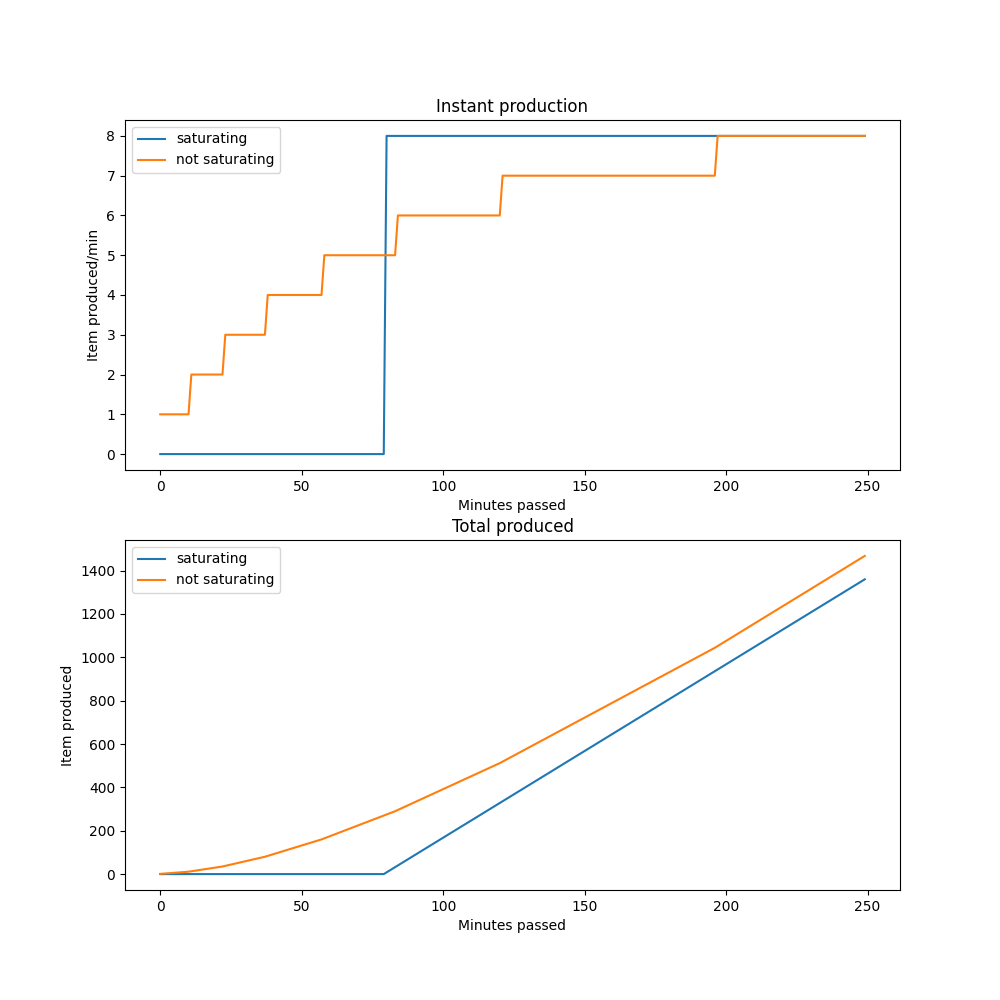

# Is saturating your factory worth it in satisfactory?

Given this parameters

```python
N_MINUTES = 250
N_FACTORIES = 8
ITEM_STACK = 200
INPUT = 20 # total items / min
USAGE = INPUT / N_FACTORIES # items / min / factory
OUTPUT = 1 # items / min / factory
```

Which correspond to 8 factories with an input of 2.5 each, and a stack size of
200



The answer is **no**! This graph show that not saturating your factories make
them produce more overall

We can assume this generalizes to bigger factories as well _insert proof by
recurrence here_

The only usefullness there is to saturating your factories is checking is
everything works perfectly, because saturating it will make it produce at its
full speed way faster
